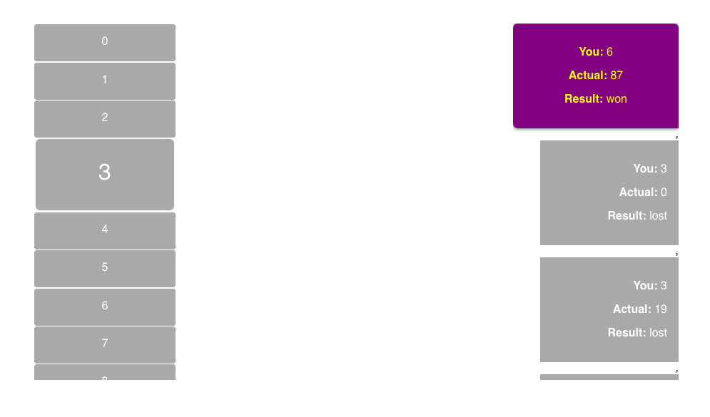

# Number game

No particular reason for the color choice, just kept it simple and as minimal as possible.

The number wheel I felt was a better choice than showing a hundred numbers on a screen and easier to navigate. It might be more interesting to show all numbers on a screen at once however and I would imagine you could have them animate & pop.

I kept the backend extremely simple, one api route. The rest are static html, js, css files so it is easier to go through rather than building a giant create-react-app.

The tests are of the backend to give a brief idea of how I write tests.

There is a http/rest files to test api's as well (game.http)

The backend is stateless so none of the scores are stored in memory or in a db. It's a front end experience only for their scores.

I went about the design first for the wheel in a codepen.io pen just to see if my initial thoughts about the wheel and css would work before I started this.
